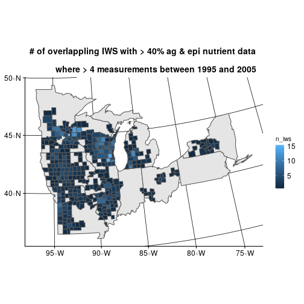
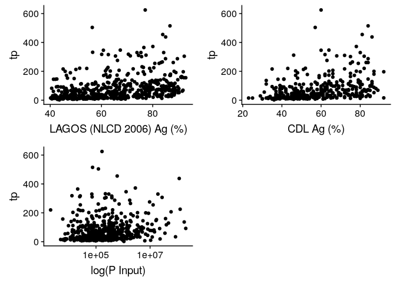

<!-- README.md is generated from README.Rmd. Please edit that file -->
Vision
------

Use more detailed Ag and soils data to improve predictive models of lake TP, TN, and Nitrate.

Potential predictor variables
-----------------------------

-   LAGOS
    -   Lake depth
    -   IWS area
    -   IWS/Lake area
-   Cropland Data Layer
    -   IWS pasture types (forage or not)
    -   IWS specific crops (corn, wheat, etc.)
    -   IWS crop frequency/rotation
-   gSSURGO
    -   IWS wetland potential (as a proxy for tile drainage)
    -   IWS soil organic carbon
    -   IWS root zone depth
    -   IWS lithology (sand %, clay %, etc.)
-   USGS
    -   IWS from county - manure, fertilizer, and deposition of N,P

Research questions
------------------

-   Is ag intensification related to changes in lake water quality?
    -   Maybe areas with reduced intensification have been improving?
-   Do ag conservation practices affect lake water quality?
-   Others?

Timeline
--------

Issues
------

-   Availability of data products through time is highly variable. How to align or decide to treat properties as constant?

